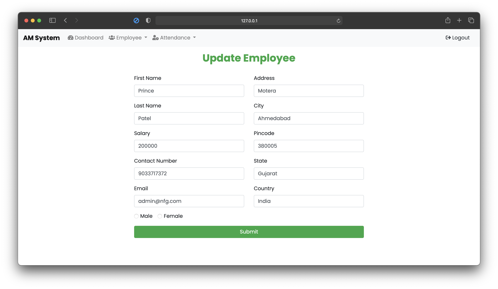

### Attendance Management System Using Django

###### Step To Install :

```
Step 1 : Download This Repository - git clone https://github.com/princu09/am-system.git

Step 2 : Install PIP - pip install -r requirements.txt

Step 3 : python manage.py runserver

Step 4 : Enjoy AM System :)
```


